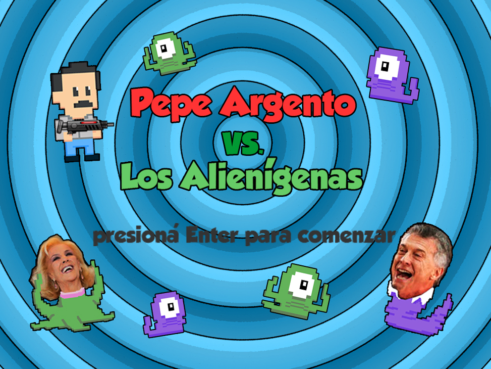

# Pepe Argento vs los Alienígenas

La Argentina se encuentra bajo amenaza tras el ataque de alienígenas, seres del espacio exterior que adoptaron la forma de famosos argentinos y se están llevando el cerebro de sus habitantes.
Por suerte contamos con Pepe Argento, que nos salvará... o al menos lo intentará.

Nuestro personaje dispondrá de 3 corazones respresentando su nivel de energía, recorrerá el escenario en busca de dinero (monedas, billetes y billetes falsos), el cual acumulará en su billetera para posteriormente poder comprar armas o alimento para reponer corazones. El escenario tendrá una perspectiva top-down y respresentará lugares conocidos de Argentina (Plaza de Mayo, Retiro, Obelisco, etc) Las armas le servirán para desintegrar a los alienígenas. Cada escenario contará con varios enemigos de menor nivel y uno poderoso. El nivel se terminará cuando se destruyan todos los aliens, o por el contrario, cuando nuestro personaje se quede sin corazones.

# Enemigos
 
-----
Tendremos dos tipos de enemigos: los de nivel bajo y los de nivel alto. Los primeros, tendrán un patrón de movimiento simple, serán de menor tamaño y si tocan a Pepe le restan medio corazón. Los de nivel alto (o jefes) se moverán en todo el margen superior del nivel, con mayor velocidad y si tocan a Pepe le restan un corazón entero, además de disparar rayos laser. Nuestro personaje necesitará las armas para desintegrarlos, si no las tiene deberá esquivarlos y seguir buscando dinero.

# Ayudas

En cada escenario tendremos la ayuda de dos personajes fijos, es decir, no se moverá sino que nosotros debemos acercarnos. A cada uno le podremos comprar diferentes ítems.

------
MaríaElena: Este personaje es el que nos ofrecerá las armas para destruir a los enemigos. El arsenal de armas podrá variar dependiendo del escenario. Cada una restará un punto de energía al enemigo y tendrá diferente valor.

------
MoniArgento: Este personaje nos ofrecerá comida para recuperar los corazones. Podremos elegir entre una porción de pizza, un sanguchito, una milanesa o un cafecito. Cada ítem tendrá diferente precio.
